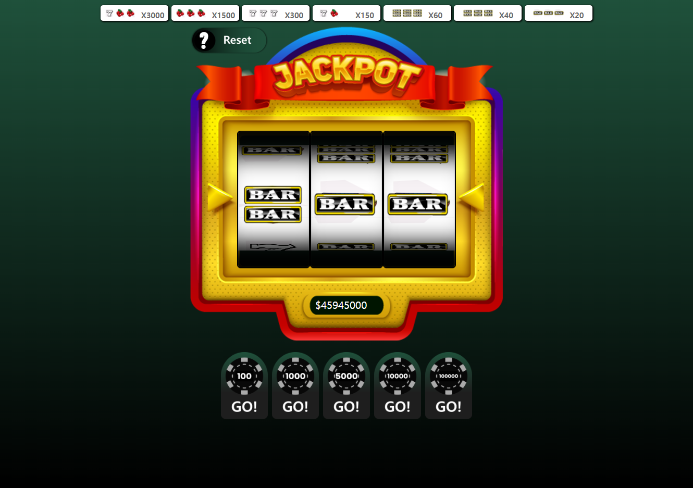

# _Jackpot Slotmachine_

### **_You can try this at this [link](https://whrgo.github.io/jackpot-slotmachine/)_**

## **Features**

- More moneys
- Custom Graphic
- No ADs
- More win options
- And more... **_(Many features will be added)_**
- 한국어 번역 (translate to korean)

#### THIS PROJECT IS CLONE OF [THIS](https:/slotmachinesimulation.github.io/)

---

### **by the way...**

This project is for only use for us (Of course you can use).

I saw a person who plays Jackpost Slotmachine Simulation at School.

It was very Cool and Nice game to studens (I am in middle school)

But this game is also very bored.

It was only fun when the jackpot hits.

So, i decided to make this extended version.

That's why this project was created.

Having fun playing at school :)

---

_this project is modified by [whrgo](https://github.com/whrgo) and this project is following [MIT LICENSE](https://github.com/git/git-scm.com/blob/main/MIT-LICENSE.txt)_

contact : discord@whrgodev#0643
